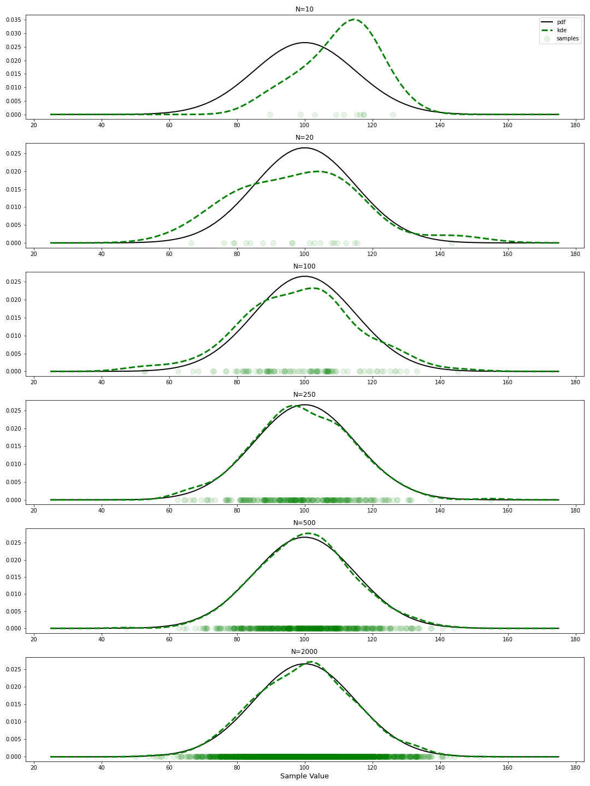

# Creating custom plotting functions with matplotlib

A step by step jupyter notebook tutorial on how to add plotting functionality to your own functions. For more modular and clean code when you need to iterate through plotting functions (and more) in a patter similar to this:

```python
fig, axes = plt.subplots(number_of_subplots)
for ax in axes:
    my_custom_plotting_function(ax=ax, function_kwargs)
```


